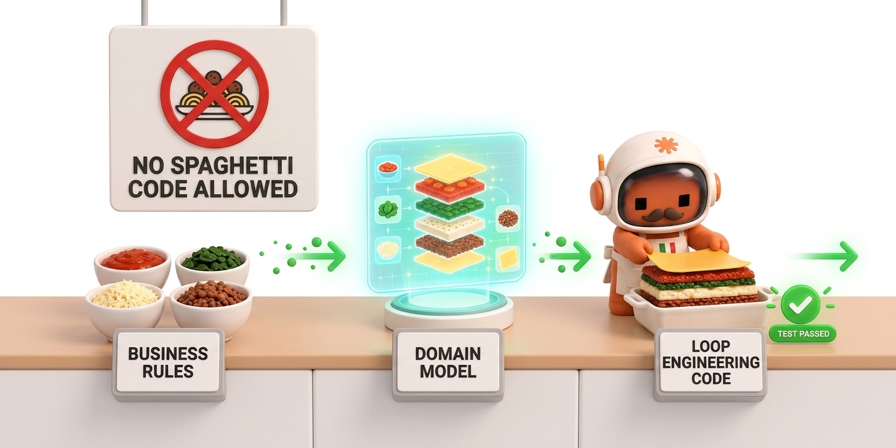

# 🍝 lasagna — Harness Layered Spec-Driven per Claude Code



[🇬🇧 English version](README.md) | [🇮🇹 Italiano](README.it.md)

> **Nota:** Questa è una versione semplificata. Per documentazione completa, roadmap e diagrammi, vedi la [versione inglese](README.md).

**L'opposto dello spaghetti code.** Un plugin per Claude Code che porta struttura allo sviluppo software attraverso specifiche precise, modellazione del dominio, contratti congelati e un ciclo rosso-verde con **ruoli di test e implementazione isolati meccanicamente**.

- **Spec-driven**: inizia con una spec precisa approvata da un umano. Il domain model ne deriva. Il contratto si congela prima di qualunque codice.
- **Test-driven**: un test per ciclo, scritto senza vedere l'implementazione. Chi scrive il test e chi implementa non condividono mai il contesto.
- **Layered**: il core del dominio è puro (senza I/O, senza clock), gli adapter toccano il mondo. Le regole di layering sono applicate ad ogni scrittura.
- **Protetto**: tre gate umani, isolamento meccanico via hook, budget di cicli fisso, e tracciabilità dai criteri di accettazione ai test.
- **Stack-agnostico**: Python/TypeScript/JVM/.NET. Progetti greenfield e codebase legacy.

---

## Il flusso

I quattro flussi principali:

1. **Ufficiale** (feature decisa): intervista → spec → domain model → contratto congelato → loop rosso-verde (budget 3) → revisione avversariale → adapter → gate PR → merge.
2. **Prototipo** (idea incerta): intervista ridotta → prototipo → validazione → se sì, riunisciti al flusso ufficiale.
3. **Bugfix** (difetto in codice che funziona): caratterizza il comportamento attuale → scrivi il test che riproduce il bug (rosso) → loop (budget 5) → revisione → merge.
4. **Brownfield** (codice legacy senza spec): reverse-engineer la spec dal codice → umano conferma cosa è voluto vs bug vs codice morto → riunisciti al flusso ufficiale.

Ogni flusso ha un **gate finale obbligatorio** (revisione PR), salvo il bugfix che può auto-mergare se configurato.

---

## Cosa è applicato, cosa no

### Meccanico (hook + script, sempre attivo a meno di disattivazione)

- **Blocco di scrittura test**: l'implementer non può editare file di test, mai. Applicato da un hook ad ogni `Edit`/`Write`.
- **Budget di cicli**: il layer dominio ha 3 tentativi dell'implementer, gli adapter ne hanno 5. Un hook conta ad ogni completamento.
- **Regole di layering**: il core del dominio non può importare infrastruttura né toccare I/O/clock/casualità. Applicato ad ogni scrittura. Su codebase legacy, le violazioni sono raccolte in una baseline e solo le nuove bloccano.
- **Cattura dell'esito test**: ogni test è classificato (verde / rosso-compile / rosso-assertion / sconosciuto) e registrato nello stato della fase.
- **Tracciabilità**: ogni criterio di accettazione `AC-<feature>-NNN` deve apparire nei file di test, e viceversa. Uno script per controllare entrambe le direzioni.

### Basato su prompt (skill e agent, seguiti in contesto, non applicati)

- **Isolamento**: chi scrive il test vede solo il criterio e il contratto congelato, mai l'implementazione. Chi implementa vede solo il test e il contratto, mai la spec. L'arbitro vede tutti e tre, decide uno.
- **Proporzionalità**: ogni fase è sottoposta al deletion test — se la sua complessità ricompare da qualche altra parte quando la salti, la esegui; se no, la salti e dichiara il salto.
- **Purezza del dominio**: gli value object sono testati tramite deletion; gli aggregati derivano dagli invarianti, non dallo schema.

---

## Installazione

### Claude Code CLI

```bash
claude plugin marketplace add TommasoTerrin/lasagna-code
claude plugin install lasagna
```

### Poi inizializza

Nel tuo progetto:

```bash
/lasagna-init
```

Scegli il tuo stack (Python/TypeScript/JVM/.NET) o lascia che lo rilevi. Lo script di init crea `.lasagna/`, scrive il profilo dello stack, aggiorna `.gitignore`, e riporta tutto quello che ha aggiunto.

**Ogni guardrail rimane inattivo finché non esiste il profilo dello stack.** Se lo script dice "NOT ready", il profilo manca — scrivilo prima di fare affidamento su qualunque hook.

---

## Utilizzo

### Inizia una feature

```bash
/lasagna official
```

oppure

```bash
/lasagna prototype
/lasagna bugfix
/lasagna brownfield
```

L'harness ti instrada verso il flusso corretto in base allo stato in `.lasagna/state/FEAT-NNN.state.md` e ti fa domande.

### Controlla lo stato

```bash
/lasagna-status
```

Mostra: id feature, fase, cicli usati, criteri coperti, escalation (se presente), checkpoint successivo.

---

## File chiave nell'harness

### Skill (10 workflow)

- **grilling**: Intervista socratica in round, scopre il profilo dello stack e i vincoli architetturali.
- **to-spec**: Use case Jacobson, criteri di accettazione con id, tassonomia degli errori, piano di rollback.
- **domain-modeling**: Aggregati dagli invarianti, deletion test per value object, aggiorna `CONTEXT.md`.
- **freeze-contract**: Firme pubbliche, tipi di errore, convenzione di ritorno, porte richieste, vista unica della seam.
- **tdd-loop**: Orchestra test-writer e implementer, osserva il rosso, conta i cicli, chiama l'arbitro su ambiguità.
- **adversarial-review**: Caccia i buchi che il test verde nasconde: percorsi di errore mancanti, stress di invarianti, edge di volume, idempotenza.
- **ports-adapters**: Fase adapter, infrastruttura vera, traduce gli errori del fornitore nei tipi del contratto.
- **characterize-bugfix**: Flusso bug senza spec: fissa il comportamento attuale, riproduci il bug, poi tdd-loop.
- **reverse-spec-brownfield**: Reverse-engineer la spec dal codice legacy, ricostruisci i use case e il modello di entità.
- **handoff**: Comprimi la sessione in un documento prima della compattazione del contesto.

### Agent (4 ruoli)

- **test-writer**: Scrive un test per ciclo da un criterio e dal contratto congelato. Osserva il rosso.
- **implementer**: Scrive il minimo per passare il test. Non può modificare file di test (l'hook lo blocca). Vede solo contratto e test.
- **referee**: Risolve una controversia su asserzione: test sbagliato, codice sbagliato, o criterio ambiguo.
- **adversarial-reviewer**: Caccia i buchi dopo il verde. Ha tutto il contesto (spec, codice, test) ma no strumento `Write`.

### Comandi (3)

- **/lasagna**: Punto di ingresso. Instrada fra i flussi, orchestra.
- **/lasagna-init**: Bootstrap: rileva lo stack, crea `.lasagna/`, scrive il profilo.
- **/lasagna-status**: Riporta senza cambiare.

### Hook (5, possono essere disattivati)

- **SessionStart**: Stampa lo stato dell'harness (forte se il profilo manca, silenzioso altrimenti).
- **PreToolUse** su Edit/Write: Blocca l'implementer da modificare file di test.
- **PostToolUse** su Bash: Classifica l'esito del test (verde / rosso-compile / rosso-assertion / sconosciuto).
- **PostToolUse** su Edit/Write: Regole di layering sul core del dominio.
- **SubagentStop** su implementer: Conta i cicli, escalate quando il budget è esaurito.
- **PreCompact**: Fissa lo stato della fase prima della compattazione del contesto.

### Template (4 tipi)

- **Spec**: Goal, non-goal, vincoli architetturali, use case Jacobson, criteri di accettazione, invarianti, tassonomia degli errori.
- **Contract**: Seam, firme, tipi, mapping degli errori, convenzione di ritorno, porte richieste, "cosa NON è congelato".
- **ADR**: Architecture Decision Record, per scelte difficili da invertire e sorprendenti con trade-off.
- **Profili dello stack** (Python / TypeScript / JVM / .NET): Comando test, pattern di esito, percorsi di test, percorsi di core, pattern proibiti (I/O, clock, ecc.), budget.

---

## Per codice legacy (brownfield)

L'harness funziona su progetti esistenti, ma le regole di layering iniziano **difensive** per evitare rumore.

Quando inizializzi su una codebase legacy:

```bash
sh plugins/lasagna/scripts/onion-baseline.sh
```

Questo registra tutte le violazioni attuali come baseline. Da allora, solo le **nuove** violazioni bloccano. La baseline è committata — il suo diff è come i reviewer vedono se stai aggiungendo debito o pagandolo.

Per controllare il drift (stiamo migliorando o peggiorando?):

```bash
sh plugins/lasagna/scripts/onion-baseline.sh --check
```

---

## Path del progetto (configurabili)

Per default:

- Spec: `.lasagna/specs/`
- Contratti: `.lasagna/contracts/`
- Stato della fase: `.lasagna/state/` (gitignored)
- ADR: `docs/adr/`
- Glossario: `CONTEXT.md`

Cambia `adr_dir` e `context_file` nel profilo dello stack se questi entrano in collisione con il tuo layout. Per monorepo, imposta la variabile d'ambiente `LASAGNA_DIR` per puntare l'harness a un package diverso.

---

## Guardrail che puoi disattivare

Nel profilo dello stack, `hooks_disabled: onion, block-tests` li spegne. Nomi noti:

- `block-tests`: Previeni all'implementer di editare file di test.
- `onion`: Regole di layering del dominio.
- `test-result`: Cattura l'esito del test.
- `budget`: Conta i cicli.
- `precompact`: Fissa lo stato della fase prima della compattazione.
- `session-status`: Stampa lo stato dell'harness all'inizio della sessione.

---

## Limiti noti

- **Nessun auto-merge nel flusso ufficiale** (i 3 gate sono decisioni umane). Il flusso bugfix può auto-mergare se configurato.
- **I subagent non possono avviare altri subagent**, quindi l'orchestrazione (il comando `/lasagna`) gira nel thread principale.
- **Gli hook leggono il profilo dello stack ad ogni uso** — i cambiamenti vengono presi immediatamente, ma un profilo mancante rende ogni hook un'operazione silenziosa (l'hook SessionStart avverte su questo).
- **La classificazione dell'esito del test è testuale, non semantica** — un test che asserisce su una stringa come "ModuleNotFoundError" potrebbe essere misclassificato come rosso-compile invece di rosso-assertion. Questo è un suggerimento per l'arbitro, mai un verdetto.

---

## Per chi è

- **Sviluppatori** che vogliono guardrail, non caos. Ottieni isolamento meccanico fra test e implementazione, un budget fisso per layer, e tracciabilità da spec a test.
- **Team** che fanno sviluppo specification-first. Il gate di approvazione della spec + domain modeling assicurano che tutti si allineino sul modello prima di qualunque codice.
- **Progetti legacy** che hanno bisogno di struttura senza il dolore di refactoizzare tutto in una volta. La baseline del ratchet ti lascia congelare il debito e pagarlo incrementalmente.
- **Org poliglotte**. Un harness, cinque profili di stack. Scegli il tuo linguaggio; i flussi sono identici.

---

## Licenza

MIT. Vedi [LICENSE](LICENSE).

---

## Derivato da

- **Spec-Driven Development**: L'approccio specification-first di Gojko Adzic.
- **Test-Driven Development**: La disciplina rosso-verde-refactor di Kent Beck.
- **Domain-Driven Design**: Ubiquitous language e aggregati di Eric Evans.
- **Hexagonal / Onion Architecture**: Port e adapter di Alistair Cockburn.
- **Loop Engineering**: Orchestrazione di agent iterativa di Augment Code.

---

## Il nome

Lasagna è l'opposto dello spaghetti code. Ogni layer è distinto, separato, e ha uno scopo chiaro. Puoi estrarre un layer, capirlo in isolamento, e ricostruirlo. Prova a farlo con lo spaghetti.
