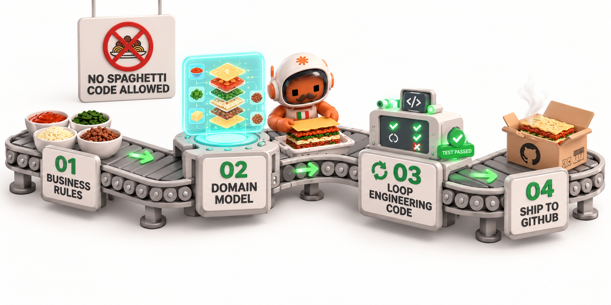

# 🍝 lasagna-code



**Layered Spec-Driven Development for Claude Code**

[🇬🇧 English](README.md) | [🇮🇹 Italiano](README.it.md)

*The opposite of spaghetti code.* A Claude Code plugin that brings structure to software development through precise specifications, frozen contracts, and a red-green loop where the agent writing the test and the agent writing the code are mechanically kept apart.

[](LICENSE)
[](https://github.com/TommasoTerrin/lasagna-code)
[](#-requirements)
[](#️-stack-profiles-language-agnostic)

---

## 🎯 What is lasagna?

lasagna is **rigid about process and flexible about architecture**.

The **process** is not negotiable — it is the product:

1. **Spec-Driven Development** — precise specifications approved by a human before code
2. **Test-Driven Development** — one test per cycle, red observed before green, built in vertical slices
3. **Isolated agents** — the test-writer never sees the code, the implementer never sees the test; a referee settles disputes; mechanical guardrails, a cycle budget and traceability keep everyone honest

The **architecture** is a preference, applied in proportion:

4. **Functional core, imperative shell** — logic that takes values and returns values, I/O at the edges. How much of it a project needs (*minimal*, *modular*, *full hexagonal*) is a question asked once, with a recommendation. On an existing codebase lasagna **adopts the conventions it finds** instead of converting them.

Each layer is **distinct, separated, and has a clear purpose**. You can pull one layer out, understand it in isolation, and rebuild it. Try that with spaghetti.

### Why lasagna, not spaghetti?

| Problem | Spaghetti Code | lasagna |
|---------|---|---|
| **No clear spec** | 🔴 Ambiguity breeds 3x cycles | 🟢 Spec approval gate before code |
| **Test-code coupling** | 🔴 Tests follow implementation | 🟢 Test-writer ≠ implementer, and neither can read the other's files |
| **Tangled layers** | 🔴 Business logic mixed with I/O | 🟢 Pure core, thin shell — reviewed, not imposed |
| **Big-bang integration** | 🔴 Logic tested against an imagined backend | 🟢 Vertical slices, tracer bullet first |
| **Silent failures** | 🔴 Budget overruns, regressions | 🟢 Per-criterion cycle budget + adversarial review |
| **No traceability** | 🔴 Acceptance criteria drift | 🟢 AC ↔ test mapping verified |

---

## 📋 Requirements

- **Claude Code** with plugin support.
- **Python ≥ 3.9** on the machine, standard library only — no `pip install`. The hooks are Python. lasagna looks for `python3`, `python`, `py -3` the first time a hook runs and remembers the one it found (`run.sh python` shows it, `run.sh python --reset` searches again, `run.sh python <path>` sets it). Without Python, the guardrails that block **fail closed** in a lasagna project, and session start says so.

---

## 🚀 Quick Start

### Installation

#### Option A: Global (Recommended for CLI users)

```bash
# Add to Claude Code marketplace
claude plugin marketplace add TommasoTerrin/lasagna-code

# Install
claude plugin install lasagna

# Restart Claude Code to load hooks
```

#### Option B: Local (For a single project)

```bash
# Clone into your project
git clone https://github.com/TommasoTerrin/lasagna-code lasagna-code

# Add to local plugins (in Claude Code settings)
# Or link via symlink:
ln -s $(pwd)/lasagna-code ~/.claude/plugins/lasagna
```

### Initialize Your Project

```bash
# In your project root
/lasagna-init

# Checks Python, detects your stack: Python, TypeScript, JVM, or .NET
# Creates: .lasagna/ (profile, architecture), docs/context/INDEX.md, updates .gitignore
# Proposes one line for CLAUDE.md — added only if you say yes
```

**Verify installation:**
```bash
/lasagna-status
# Shows: stack profile, architecture level, current phase and slice, readiness
```

> **Note:** All guardrails remain inactive until `.lasagna/stack.md` exists. If nothing blocks, the profile is missing — run `/lasagna-init`.

---

## 📊 Four Workflows for Different Scenarios

### 1. Official Flow → New feature (greenfield)

**When:** You have a **decided feature**, budget, and clear vision.

```bash
/lasagna official
```

**Flow:**
```
📝 Grilling (Socratic interview)
   ↓ Stack profile, separation level (once per project), contexts touched,
   ↓ consistency / contention / partial failure / volumes
📄 Spec (use cases, criteria with ids, error taxonomy, vertical slices)
🟨 GATE 1: Spec Approval (human decision)
   ↓
🧬 Domain Modeling (rules, invariants, the module each one lives in;
   ↓                aggregates only where atomic consistency needs them)
❄️ Freeze Contract (signatures, error types, external dependencies)
   ↓
🟨 GATE 2: Contract Approval (human decision)
   ↓
🔴🟢 TDD Loop, slice by slice — S1 is a tracer bullet end to end
   ↓   core tests (budget 3) → shell (budget 5) → integration test on real infra
   ↓ Hook: implementer can neither write nor read test files
   ↓ Hook: test-writer cannot read production code
   ↓ Hook: test outcome captured from the real run
   ↓ Hook: cycles counted per criterion
   ↓
⚔️ Adversarial Review (gaps, unrequested code, design drift, uncovered risks)
   ↓
🟨 GATE 3: PR Review (human decision)
   ↓
✅ Merge
```

**Mechanically enforced:**
- ✅ Implementer cannot write **or read** test files
- ✅ Test-writer cannot read production code during the loop
- ✅ Red observed from the real test run before any implementation
- ✅ Cycle budget per criterion (3 core, 5 shell and bugfix), escalation when spent
- ✅ Traceability (every AC maps to a test, every test to an AC)

**Human-decided:**
- 👤 Spec captures real requirements
- 👤 Contract is unambiguous
- 👤 How much architecture the project needs
- 👤 PR passes final review

---

### 2. Prototype Flow → Validate an idea

**When:** You have a **question**, not an answer. Need to validate before committing to spec.

```bash
/lasagna prototype
```

**Flow:**
```
📝 Grilling (reduced)
   ↓ Just the research question
🏗️ Build & Validate
   ↓ Walking skeleton on real infrastructure
✅ Demo works?
   ├─ YES → Re-enter through brownfield (becomes a feature)
   └─ NO  → Abandon or pivot
```

**Characteristics:**
- ⚡ No spec, no gates, fast
- 🎯 Goal: answer the question
- 📈 If validated: convert to official feature

**Typical uses:**
- "Does Postgres support our query patterns?"
- "Can we integrate with vendor X's API?"
- "Is polling good enough, or do we need WebSockets?"

---

### 3. Bugfix Flow → Defect in working code

**When:** Production bug or defect in existing, working code.

```bash
/lasagna bugfix
```

**Flow:**
```
🔍 Characterize (phase: characterize — the test-writer may read the code here)
   ↓ Tests that PASS with the bug (current behavior)
🔴 Reproduce
   ↓ Test that FAILS with the desired behavior
🟢 TDD Loop (budget 5, no spec)
   ↓ Implementer fixes the bug from the failure output — it cannot read the tests
   ↓
⚔️ Adversarial Review (focus on regressions)
   ↓ Did the fix break something else?
✅ Merge (auto or manual)
```

**Characteristics:**
- 💊 Higher budget (5 vs 3) — bugfixes are messier
- 📋 No spec — test and code only
- 🤖 Can auto-merge if `bugfix_automerge: true` in stack profile

---

### 4. Brownfield Flow → Existing code without spec

**When:** Changing existing code that no spec describes.

```bash
/lasagna brownfield
```

**Flow:**
```
🔍 Reverse-Spec-Brownfield
   ↓ Detect the project's conventions → .lasagna/architecture.md (human confirms)
   ↓ Extract spec from code:
   ├─ Entry points → use cases
   ├─ Schema → entity model
   └─ Behaviors → acceptance criteria (with sources)
👤 Human Confirm
   ↓ What was intended vs bug vs dead code?
🟨 GATE 1: Approve Extracted Spec
   ↓
→ Continue as Official Flow — new code follows the detected conventions
```

**Adopt, don't convert:** lasagna does not turn every feature into a migration towards another architecture. Where the code looks, errors are raised, dependencies are injected and tests are written the way the project already does it. Better ideas go to `.lasagna/design-notes.md` as proposals — with a reason and a cost — and nothing there is applied without a discussion. If the code is too tangled to build on, lasagna stops and asks.

---

## 🏗️ Architecture & Principles

### Functional Core, Imperative Shell — in proportion

```
        🌍 External World (HTTP, DB, Queue, Clock)
        ↑ ↓
    ┌───────────────────┐
    │  Shell            │  ← endpoints, CLI, jobs, storage, network
    │  (thin, few ifs)  │  → gathers data, calls the core, applies the result
    └────────┬──────────┘
             ↓ ↑  values in, values out
    ┌───────────────────┐
    │  Core             │  ← business rules: no I/O, no clock,
    │  (pure functions) │     no randomness, no environment
    └───────────────────┘
```

Five rules, as guidance for the model and checklist for the reviewer — **not** checked by a hook:

1. Logic lives in "poor" modules: standard library plus a few declared libraries.
2. I/O lives at the edges: `now` is a parameter, configuration is an object.
3. An abstraction (`Protocol` / interface) only when it pays: the technology may really change, the test must replace something slow, or two implementations exist. Otherwise pass a value.
4. Vendor types (HTTP errors, ORM models, SDK objects) are translated at the edge.
5. Organise by feature (`billing/`, `auth/`), not by technical layer.

**How much** of this a project needs is asked once, in grilling, and recorded in `.lasagna/architecture.md`:

| Level | When |
|---|---|
| **minimal** | little business logic: scripts, simple CRUD — one pure module + the edges |
| **modular** (usual default) | non-trivial logic, some external dependencies — a pure core per feature module |
| **full-hexagonal** | complex domain, several real adapters per port, strong consistency — ports, adapters, aggregates |

**Why?** A pure core is tested by passing values — no mocks, few end-to-end tests — and changing a vendor touches the shell only.

### Test Isolation: Mechanical Separation

**Test-Writer** and **Implementer** never share context:

```
Test-Writer sees:
  ✅ Acceptance Criterion (AC-FEAT-001-NNN)
  ✅ Frozen Contract (signatures, types, errors, how tests control dependencies)
  ❌ Production code (hook denies Read/Grep/Glob, and Bash that names it, during tdd-loop)

Implementer sees:
  ✅ Frozen Contract (what to implement)
  ✅ The failing test's name and failure output
  ❌ The test file (hook denies reading AND writing it)
  ❌ Spec and criterion (might bias the implementation)

Referee sees:
  ✅ Criterion, contract, test, failure — not the implementation
     Decides: test wrong, code wrong, or criterion ambiguous (→ human)
```

**Why?** A test written while looking at the code photographs the code. Code written while looking at the test is shaped around its literal values. Both have to come from the contract.

**Honest limit:** the Bash filter is a heuristic — a sufficiently creative command can get past it. It is an obstacle, not a wall; the agents are told why it exists, and the adversarial reviewer reads the result.

### Vertical Slices

The spec cuts the work into **slices**, each one a thin path through everything a user would touch. The first is a **tracer bullet**: the thinnest end-to-end path, proving the wiring before anything is built on it. Inside each slice: core tests first, then the shell, then an integration test against real infrastructure if the slice touches the world.

### Fixed Budget, per Criterion

```
Core tests:        3 implementer attempts per criterion
Shell/integration: 5 attempts per criterion
Bugfix:            5 attempts
```

The count resets every time a criterion closes green. When a criterion spends its budget without green: automatic escalation to a human. No silent overruns.

### Mechanical Traceability

Every acceptance criterion `AC-FEAT-NNN-NNN` must appear in test code, and vice versa.

```bash
/lasagna-status
# Shows: criteria covered, uncovered, orphan test references
```

---

## 💻 Implementation: Agents & Skills

### Four Agents (Roles)

| Agent | Sees | Cannot see | Tools |
|-------|------|-----------|-------|
| **test-writer** | Criterion + contract | Production code (in tdd-loop) | Read, Write, Edit, Bash, Grep, Glob |
| **implementer** | Contract + failure output | Test files (read or write), spec | Read, Write, Edit, Bash, Grep, Glob |
| **referee** | Criterion, contract, test, failure | The implementation | Read, Grep, Glob — no Write |
| **adversarial-reviewer** | Everything | — | Read, Grep, Glob, Bash — no Write |

### Ten Skills (Workflows)

1. **grilling** — Socratic interview: stack profile, separation level, contexts, the four architectural axes
2. **to-spec** — Jacobson use cases, acceptance criteria, error taxonomy, vertical slices
3. **domain-modeling** — Rules, invariants and where each lives; aggregates only when needed
4. **freeze-contract** — Signatures, error types, external dependencies and how tests control them
5. **tdd-loop** — Slice by slice: test-writer and implementer, observed red, per-criterion budget
6. **adversarial-review** — Gaps, unrequested code, design drift, risks the spec does not cover
7. **pr-gate** — Gate 3: spec diff, traceability, review report, cycles; archive after merge
8. **characterize-bugfix** — Pin current behavior, reproduce the bug, fix through the loop
9. **reverse-spec-brownfield** — Detect conventions, extract a spec from existing code
10. **handoff** — Compress the session into one document before ending or compaction

### Six Hooks (Only Where a Mechanical Truth Is Needed)

| Hook | Trigger | Action | Can Be Disabled |
|------|---------|--------|---|
| **block-test-edits** | Edit/Write on a test file by the implementer | Exit 2, deny the write | `hooks_disabled: block-tests` |
| **block-reads** | Read/Grep/Glob/Bash by the implementer on tests, or by the test-writer on production code in `tdd-loop` | Exit 2, deny the read; running the suite is always allowed | `block-test-reads`, `block-code-reads` |
| **capture-test-result** | Bash runs the test command | Classify outcome (green/red/unknown) from the real output | `test-result` |
| **count-cycle** | Implementer/test-writer/referee finishes | Count attempts per criterion, reset on green, escalate when spent | `budget` |
| **dump-phase-state** | Context compaction starts | Pin phase state to disk | `precompact` |
| **session-status** | Session starts | One line: phase, cycles, escalation, Python in use | `session-status` |

Everything else — language, libraries, architecture — is the model's judgement and the reviewer's job. Hooks that police style only recreate noise and rigidity.

---

## 📁 Project Structure

```
your-project/
├── CLAUDE.md                     # one line pointing at docs/context/ (with your consent)
├── docs/
│   ├── adr/NNNN-slug.md          # Architecture Decision Records (permanent)
│   └── context/                  # Project context (permanent)
│       ├── INDEX.md              # one line per bounded context
│       ├── billing.md            # glossary of one bounded context
│       └── structure.md          # minimal code map (ages faster: kept apart)
│
└── .lasagna/                     # lasagna harness
    ├── stack.md                  # Stack profile: how the project runs (committed)
    ├── architecture.md           # Separation level and conventions (committed)
    ├── design-notes.md           # Proposed improvements, not applied (committed)
    ├── specs/
    │   ├── FEAT-001.md           # Active spec (committed, ephemeral)
    │   └── archive/
    ├── contracts/
    │   └── FEAT-001.md           # Frozen contract (committed)
    └── state/
        └── FEAT-001.state.md     # Phase state: slice, cycles, outcomes (NOT committed)
```

Each phase loads `docs/context/INDEX.md` and only the contexts the spec lists in `contexts:` — not the whole folder.

**What survives the feature:**
- ✅ ADRs (permanent reference)
- ✅ Project context (glossaries evolve with the code)
- ✅ Tests (become regression suite)

**What doesn't:**
- ❌ Spec (archived after feature closes)
- ❌ Phase state (per-feature, local)

---

## 🛠️ Stack Profiles (Language Agnostic)

lasagna ships with profiles for **Python, TypeScript, JVM, and .NET**. A profile says how the project **runs** — not how it is organised:

```
# .lasagna/stack.md
language: python
test_command: uv run pytest
test_command_pattern: (pytest|uv run pytest|python -m pytest)
test_file_pattern: (^|/)tests?/|(^|/)test_[^/]*\.py$|conftest\.py$
source_path: src/
budget_core: 3
budget_shell: 5
budget_bugfix: 5
context_dir: docs/context
bugfix_automerge: false
```

**Add your own:** Copy a profile, update the patterns for your runner and layout. v1 profiles keep working: old keys are mapped or ignored, and session start suggests updating.

---

## 🎓 Why lasagna vs Traditional SDLC?

### Waterfall (Document Everything)

```
Spec → Design → Dev → Test → Ops
❌ Expensive to change at any stage
❌ Testing finds bugs at the end (most expensive)
❌ No feedback loop
```

### Agile/Scrum (Iterate Fast)

```
Backlog → Sprint → Demo → Backlog
✅ Fast iteration
❌ Test often skipped ("ship it")
❌ Spec drifts (spec and code diverge)
❌ No isolation: devs write tests too (tautology)
```

### lasagna (Iterate with Structure)

```
Spec (gate) → Contract (gate) → Slices: TDD Loop (isolated agents, budget, hooks) → Review (gate) → Merge
✅ Fast iteration, vertical slices from day one
✅ Test comes first, from an agent that never saw the code
✅ Spec approval prevents ambiguity later
✅ Mechanical isolation: test-writer ≠ implementer (no tautology)
✅ Budget enforcement: impossible to overrun silently
✅ Traceability: requirements ↔ tests (auditable)
```

### Real-World Impact

| Scenario | Waterfall | Agile | lasagna |
|----------|-----------|-------|---------|
| **Spec ambiguity discovered** | Rework at end (10x cost) | Rework in next sprint | Gate 1: fix before code (free) |
| **Test doesn't match code** | Catches at acceptance | Won't happen (dev wrote both) | Catches immediately (isolated agent) |
| **A criterion won't go green** | War room | Ship tech debt | Escalation at its 3rd attempt (known early) |
| **Regression in production** | Hotfix fire | Hotfix + sprint debt | Adversarial review caught it (pre-merge) |
| **Onboard new developer** | Read 20-page spec | Read backlog | Read spec + frozen contract + context glossary |

---

## 🔮 Roadmap & Planned Evolutions

### Phase 1: Stable Core ✅
- [x] Four workflows (official, prototype, bugfix, brownfield)
- [x] Mechanical isolation (test-writer, implementer, referee)
- [x] Cycle budgets and traceability

### Phase 2: GitHub Integration

- Start a flow directly from a GitHub issue: fetch it, extract acceptance criteria from the body or comments, create the spec, and route to the right flow (`/lasagna official`, bugfix, ...).
- Extend the existing AC ↔ test traceability check to GitHub: `/lasagna-status` reports which issue an AC belongs to, and whether a PR closes it once every AC is covered.
- Post adversarial-review findings as inline PR comments, so gaps surface where the reviewer is already looking.

---

### Phase 3: Adaptive System Design ✅ (v2)

- [x] Process separated from architecture: hooks only for test truth, isolation, budget and state
- [x] *Functional core, imperative shell* in proportion — the separation level is a question with a recommendation, not a mandate
- [x] Existing codebases: conventions detected and adopted; proposals in `design-notes.md`
- [x] Vertical slices with a tracer bullet; real read isolation for both agents
- [x] Hooks in Python with a test suite; eval suite with `claude plugin eval`

---

### Phase 4: Quality Signal & Spend Control

- **[jev](https://typesafe.ai/blog/introducing-system-one-models-and-jev)-style binary classification**: a fast, calibrated model that answers one question at existing decision points (test-outcome capture, `referee`, `adversarial-review`) — *given the spec, the frozen contract, and the current state, is this test/code valid against what was actually written?* Meant to replace today's textual heuristic (see Known Limitations) with a real classifier, not to write code or tests itself.
- **Model & spend control**: route this kind of mechanical classification to cheap/fast models, reserve stronger models for spec, domain-modeling and implementation, and track per-cycle cost so budget overruns are visible before they're a surprise. Mechanism still to be designed.

---

### Phase 5: Modularity & Extensibility

- **Independent phase evolution**: decouple skills/agents/hooks/templates enough that each phase (grilling, contract, tdd-loop, adversarial-review, deploy, ...) can change without rippling into the others.
- **Org-level extensions without forking**: a layer where a team can inject its own context, conventions and questions into grilling/spec/review without editing the plugin's own files (which get overwritten on update).
- **Team support**: feature ids that do not collide across branches, shared phase state, gates tied to real approvals (PR reviews, CODEOWNERS).

---

### Phase 6: Deploy & DevOps

- **CI/CD & IaC support** (Docker, Terraform or similar) after the PR gate, kept independent of whichever architecture the project actually uses.

---

### Phase 7: Beyond Claude Code

- **Adapted variants for other agent tools**: rather than one abstracted engine, ship sibling folders that reproduce lasagna's mechanics (hooks, gates, isolation) using each tool's own primitives; people pull from the repo whichever variant matches the tool they use.

---

## 📖 Examples & Tutorials

### Example 1: New Feature (Official Flow)

A startup wants to build a "User Invites" feature.

```bash
/lasagna official
# → grilling: invite link + email + expiry; separation level "modular"
#   (some logic, one external system: email) — recommended, user agrees
# → to-spec: 3 use cases, 5 acceptance criteria, 3 slices
#   S1 (tracer): create an invite and store it, end to end
# GATE 1: Product lead approves spec

# → domain-modeling: rules for token and expiry, living in invites/
#   (no aggregate: nothing needs atomic consistency across objects)
# → freeze-contract: create_invite(email, now) -> Invite, InviteExpired error;
#   External dependencies: now = parameter, invite storage = Protocol + in-memory fake,
#   email = Protocol + fake
# GATE 2: Tech lead approves contract

# S1: core test (budget 3) → green in 1 → shell + integration test on a real DB (budget 5) → green in 2
# S2: send the email: core green in 1, SMTP sandbox integration green in 2
# S3: expiry: core green in 2 — each criterion starts with a fresh budget
# → adversarial-review: one gap (expiry at the exact boundary) → one more cycle
# GATE 3: PR merged with full traceability
```

### Example 2: Bugfix (Production Issue)

Customer reports: "Invites sent after 5pm never expire correctly."

```bash
/lasagna bugfix
# → characterize: tests pin the current behavior (test-writer may read the code here)
# → reproduce: a test shows the desired behavior, red
# → tdd-loop: implementer fixes it from the failure output (budget 5)
# → adversarial-review: check for regressions in the expiry flow
# ✅ Auto-merge (if configured)
```

### Example 3: Existing FastAPI service (Brownfield)

```bash
/lasagna brownfield
# → reverse-spec: logic in app/services/, DomainError subclasses mapped to HTTP
#   in main.py, repositories passed as parameters, in-memory fakes in tests.
#   Recorded in architecture.md, confirmed by a human.
# → the new "cancel order" endpoint follows exactly those conventions:
#   no ports/ folder, no adapters/ folder.
# → design-notes.md: "confirm_order mixes loading and deciding — splitting it
#   would make it pure (cost: S)". Proposed, not applied.
```

---

## 🧪 Evaluating the plugin

`plugins/lasagna/evals/` holds a suite for `claude plugin eval`: routing, gates, isolation, proportionality, adaptation to existing code, the separation-level question, and a slow end-to-end case. Every case also runs **without** the plugin, so each score comes with the delta the plugin is responsible for. See [plugins/lasagna/evals/README.md](plugins/lasagna/evals/README.md).

---

## 🛡️ Known Limitations

- **No auto-merge in official flow** — three gates are human decisions (by design)
- **Subagents cannot spawn subagents** — orchestration runs in main thread
- **Stack profile must exist** — all hooks silent no-op if `.lasagna/stack.md` missing
- **Python ≥ 3.9 required** — without it the blocking guardrails deny in a lasagna project, the others go quiet with a warning
- **The Bash read filter is heuristic** — an obstacle, not a wall
- **Test outcome classification is textual** — a test asserting on the string "ModuleNotFoundError" may be misclassified
- **Single developer** — feature ids and phase state are not yet designed for teams

---

## 🔗 Integrations & MCP Servers

Future support for:

- **GitHub** — fetch issues, auto-create AC, PR comments from reviews
- **Linear / Asana** — sync status, update tickets, link to ADRs
- **Slack** — notify team of gates, async handoff
- **PagerDuty** — escalate when budget spent or adversarial review fails
- **Figma / Miro** — embed architecture diagrams in contracts

---

## 📚 Further Reading

### Core Concepts

- [Spec-Driven Development](https://gojko.net/books/specification-by-example/) — Gojko Adzic
- [Test-Driven Development](https://www.oreilly.com/library/view/test-driven-development/0321146530/) — Kent Beck
- [Boundaries](https://www.destroyallsoftware.com/talks/boundaries) — Gary Bernhardt, the origin of *functional core, imperative shell*
- [Hexagonal Architecture](https://alistair.cockburn.us/hexagonal-architecture/) — Alistair Cockburn
- **Domain-Driven Design** — Eric Evans
- *Testing on the Toilet* — Google's testing tips, behind the test-writer's and reviewer's rules on test doubles

### lasagna Design

- **SDLC harness** — foundation for spec-driven workflows
- Loop engineering: [Augment Code](https://augmentcode.com/)
- Structured prompts, vertical slices and tracer bullets: [mattpocock/skills](https://github.com/mattpocock/skills)

---

## 🤝 Contributing

Issues, PRs, and discussion are welcome. See [CONTRIBUTING.md](CONTRIBUTING.md) — including how to run the hook tests and the eval suite.

### Before you start

1. Read [CODE_OF_CONDUCT.md](CODE_OF_CONDUCT.md)
2. Check [open issues](https://github.com/TommasoTerrin/lasagna-code/issues)
3. For large changes, open a discussion first

### What we're looking for

- **Bug reports** — with reproducible steps
- **Feature requests** — with use case and constraints
- **Stack profile contributions** — Go, Rust, PHP, etc. — with real runner output for the golden tests
- **Eval cases** — behaviour you want the plugin to keep
- **Documentation improvements** — especially examples and diagrams

---

## 📄 License

MIT License — see [LICENSE](LICENSE)

---

## 👤 Author

**Tommaso Terrin**

- GitHub: [@TommasoTerrin](https://github.com/TommasoTerrin)
- LinkedIn: [Tommaso Terrin](https://www.linkedin.com/in/tommaso-terrin-750472253/)
- Email: tommaso@terrin.eu

---

## 🙏 Acknowledgments

lasagna draws from:

- **Spec-Driven Development** (Gojko Adzic)
- **Test-Driven Development** (Kent Beck)
- **Functional Core, Imperative Shell** (Gary Bernhardt)
- **Hexagonal Architecture** (Alistair Cockburn) and **Domain-Driven Design** (Eric Evans)
- **Testing on the Toilet** (Google)
- **Loop Engineering** (Augment Code's iterative agent orchestration)
- **Structured Prompts** (mattpocock/skills)

---

## 📞 Support

- **Issues & Bugs** → [GitHub Issues](https://github.com/TommasoTerrin/lasagna-code/issues)
- **Security** → Email tommaso@terrin.eu with `[SECURITY]` in subject

---

**Made with ❤️ for developers who love structure, not chaos.**
